# Understanding Clouds from Satellite Images
### Disclaimer
This project was conducted for University of Toronto - School of Continuing Studies (SCS) as part of the Deep Learning 3546 Course. The dataset used for this project was retrieved from https://www.kaggle.com/c/understanding_cloud_organization

Submitted By:
 - Rueen Fiez
 - Nareshkumar Patel
 - Nisarg Patel

## Introduction

## Setup
Libraries used for the project:
- Mask R-CNN (V 2.1.0) - https://github.com/matterport/Mask_RCNN
- Keras (V 2.2.5) - https://github.com/keras-team/keras/
- TensorFlow (V 1.1.5) - https://github.com/tensorflow/tensorflow
- COCO Weights - http://cocodataset.org/#home

Folder Structure setup for training the model: 
.SCS-DL-3546-Final-Project

## Exploratory Data Analysis (EDA) 

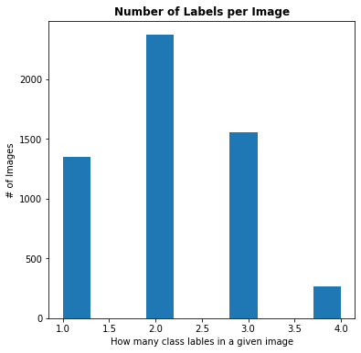

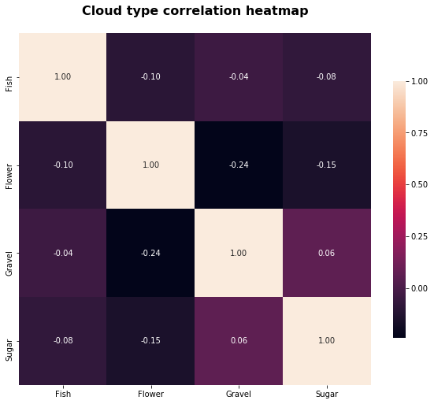

## Mask R-CNN Model

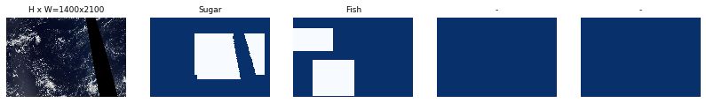
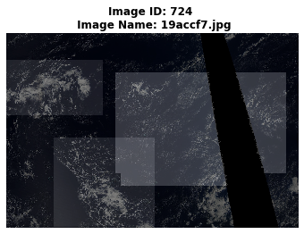

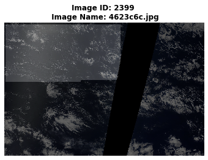

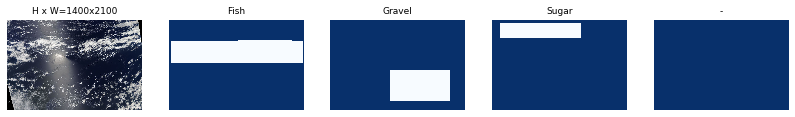
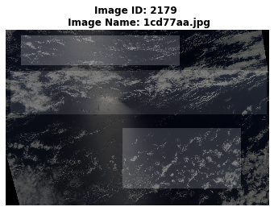

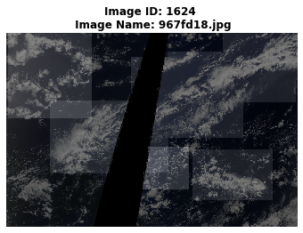

## Training & Validation Loss
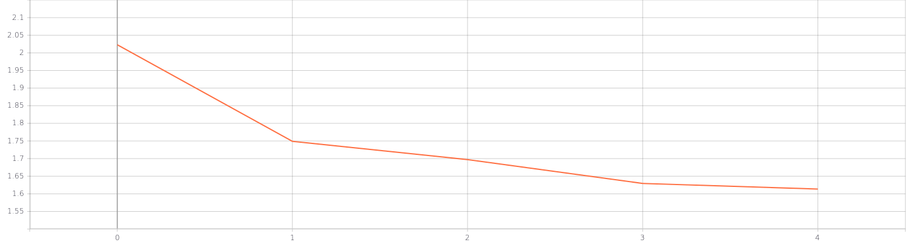
*Training Loss*

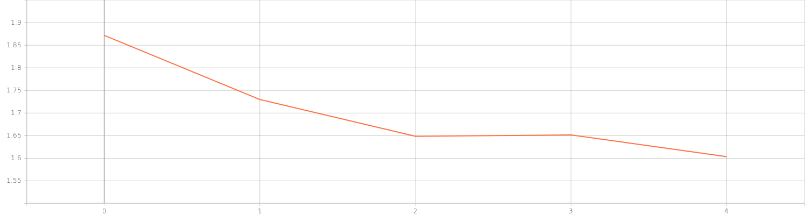
*Validation Loss*

## Conclusion
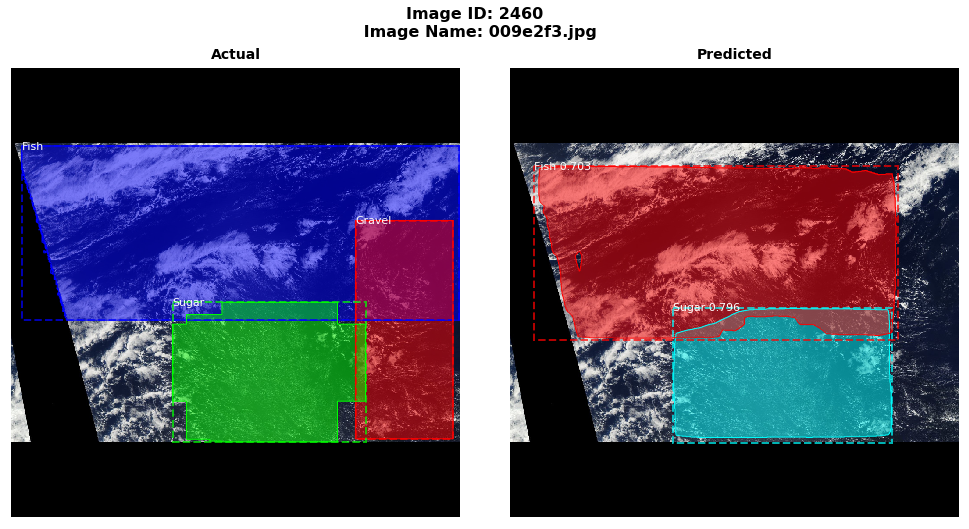
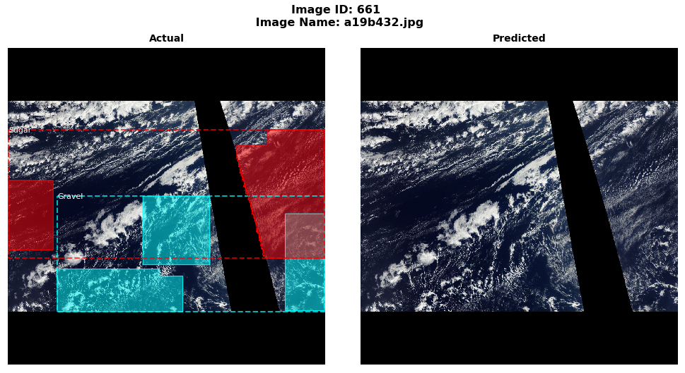

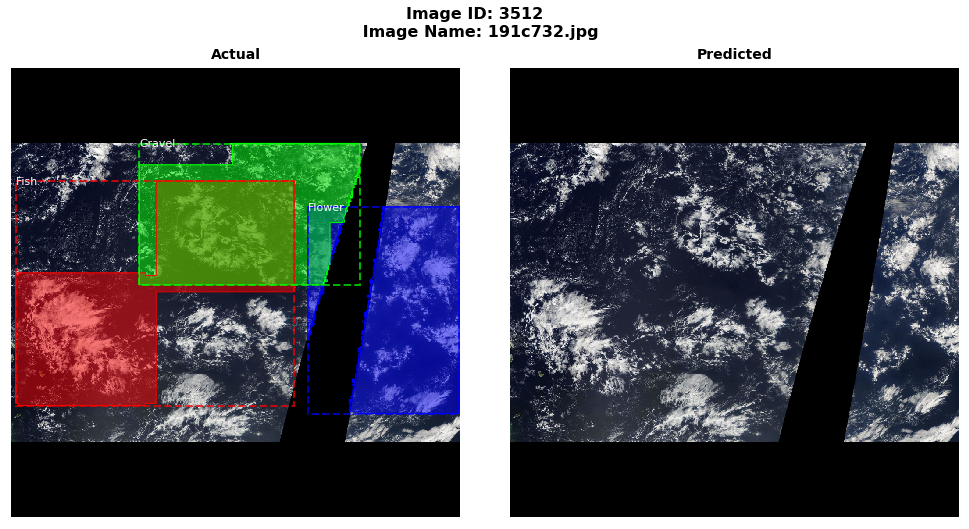

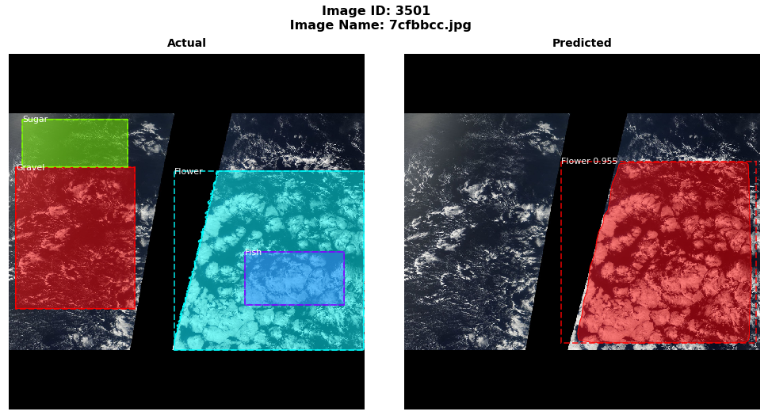

## Model Evaluation

## Next Steps

### Presentation
- [PowerPoint](https://github.com/nishp763/SCS-DL-3546-Final-Project/blob/master/presentation/Cloud_Image_Classfication_Presentation.pptx)
- [PDF](https://github.com/nishp763/SCS-DL-3546-Final-Project/blob/master/Cloud_Image_Classfication_Presentation_COPY.pdf)
- [YouTube Video](https://youtu.be/wAOazvwSG5k)
